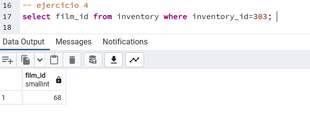

## Ejercicios - Introducción a SQL

A partir de la base de datos suministrada y mediante DQL. Hacer las consultas (queries) necesarias para responder las siguientes preguntas:

### 1. ¿Cuántas tiendas (store) hay en total?
### 2. ¿Cuántas películas (film) tienen una duración de más de 120 minutos?
### 3. ¿Cuántos pagos realizó el cliente (customer) con el ID 472?
### 4. ¿Cuál es el ID de la película (film) que tiene un ID de inventario (inventory) 303?
### 5. ¿Cuál es la dirección (address) y distrito (district) de la persona cuyo teléfono es 634445428822?

-- ejercicio 1

SELECT COUNT(*) as total_stores FROM store;

-- ejercicio 2 

SELECT COUNT(*) AS film_duration FROM film WHERE length > 120;

--ejercicio 3 

SELECT COUNT(*) AS total_pay FROM payment WHERE customer_id = 472;

-- ejercicio 4

select film_id from inventory where inventory_id=303; 

 
-- ejercicio 5

 select address, district from address where phone='634445428822'; 

 

 