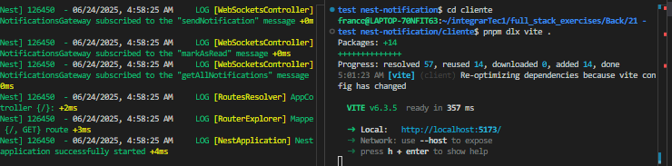
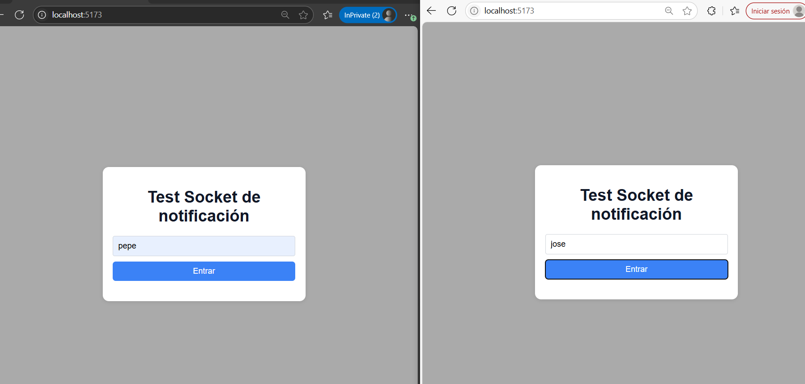
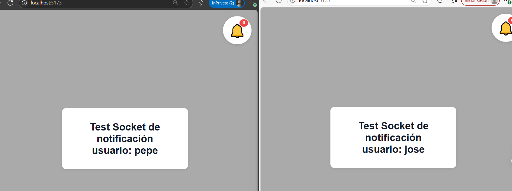
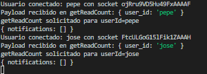
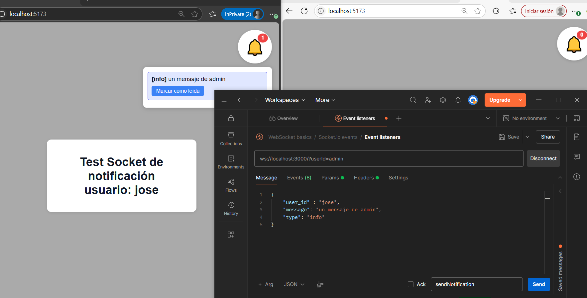
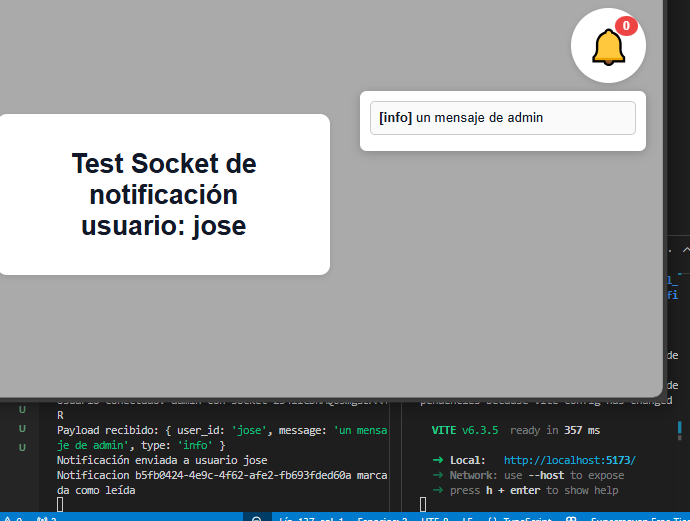
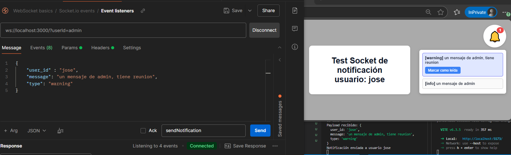
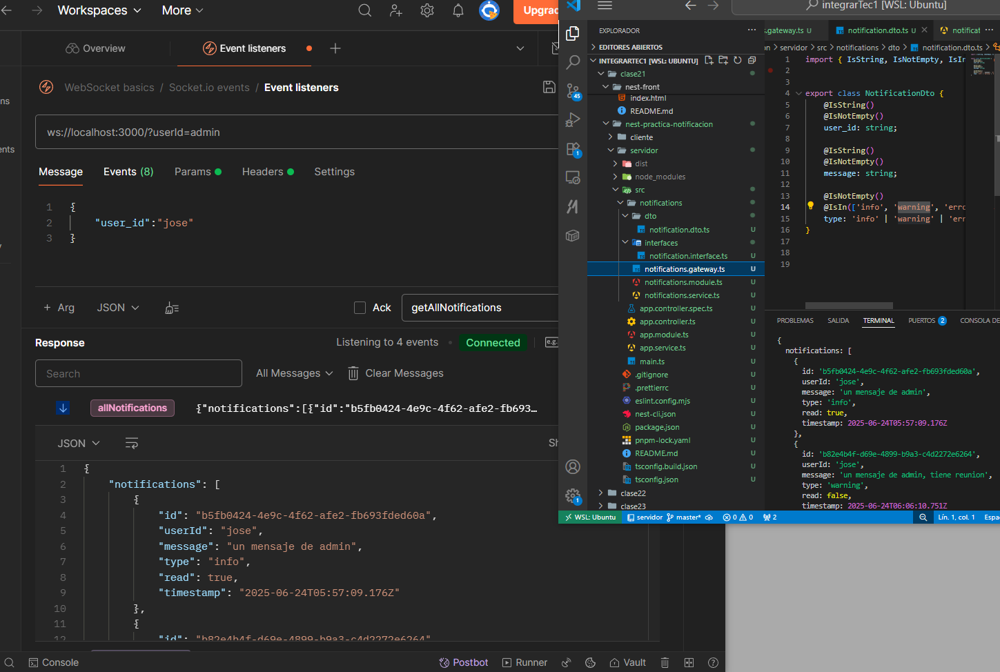
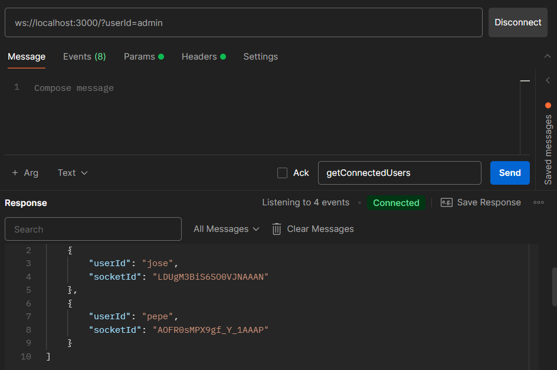

# 🛎️ Ejercicio Práctico: Notificaciones en Tiempo Real con NestJS

## en carpeta clientes -> tengo index.html que corro con pnpm dlx vite .
## en carpeta servidor -> tengo proyecto nest.js que corro con pnpm start:dev

## 🎯 Objetivo

Implementa un sistema de notificaciones en tiempo real usando NestJS y WebSockets, donde los usuarios reciban alertas personalizadas al estar conectados. Estas notificaciones se integrarán posteriormente en un componente tipo navbar (como una campana o panel lateral).

---

## 🧩 Requisitos con capturas

### ✅ Funcionalidad del servidor

- El servidor puede enviar notificaciones dirigidas a **usuarios específicos**.

### ✅ Comunicación en tiempo real

- El cliente recibe notificaciones automáticamente mediante **WebSockets**.

### ✅ Gestión de estado

- Las notificaciones pueden marcarse como **leídas**, y este estado debe sincronizarse con el servidor.

### ✅ Ver todas las notificaciones de un usuario en este caso jose

### opcional ver todos usuarios conectados

---
🧠 Reglas de negocio
Cada notificación debe tener: id, userId, message, type, read: boolean, timestamp.
Un usuario solo debe recibir notificaciones que le correspondan.
El contador de notificaciones no leídas debe actualizarse en tiempo real.

💡 Estructura sugerida
src/
 -> notifications/
 -> notifications.module.ts
 -> notifications.service.ts
 dto/
    notification.dto.ts
interfaces/
    notification.interface.ts

## 🔧 Interfaces sugeridas

// interfaces/notification.interface.ts
export interface Notification {
  id: string;
  userId: string;
  message: string;
  type: 'info' | 'warning' | 'error' | 'success';
  read: boolean;
  timestamp: Date;
}

export interface NotificationUser {
  id: string;
  socketId: string;
  userId: string;
}

## practica para notificacion algunas notas tomadas

1
touch index.html -> en carpeta aparte

2

dos carpetas
cliente y servidor
nest new .

eligo pnpm
nest generate gateway chat
3
 pnpm add @nestjs/websockets @nestjs/platform-socket.io socket.io
4 
al equivocarse
borrar  ->rm src/chat/chat.gateway.ts
pnpm remove @nestjs/websockets @nestjs/platform-socket.io socket.io

5
voy devuelta 
nest g module notifications
nest g service notifications

asi quedaria

src/
 -> notifications/
 -> notifications.module.ts
 -> notifications.service.ts
 dto/
    notification.dto.ts
interfaces/
    notification.interface.ts

 luego aplico mi carpeta DTO data transfer object

 nest g class notifications/dto/notification.dto --flat

asi para mi interface 
nest g interface notifications/interfaces/notification --flat

comienzo detectado mi DTO
con 
import { IsString, IsNotEmpty, IsIn } from 'class-validator';

export class NotificationDto {
    @IsString()
    @IsNotEmpty()
    user_id: string;

    @IsString()
    @IsNotEmpty()
    message: string;

    @IsNotEmpty()
    @IsIn(['info', 'warning', 'error', 'success'])
    type: 'info' | 'warning' | 'error' | 'success';
}

