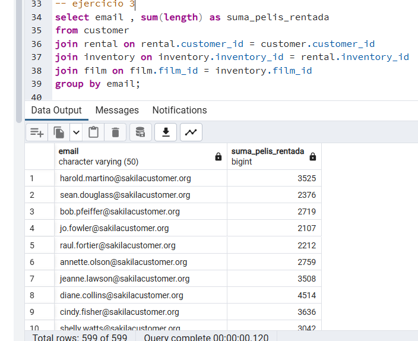

# Ejercicios

## A partir de la base de datos suministrada y mediante DQL. Hacer las siguientes consultas (queries):

### Contar cuántas películas empiezan con la letra S.
### Sumar la duración en minutos de todas las películas clasificadas para PG-13.
### Mostrar todos los emails de los clientes junto con la suma de todas las películas que rentaron.
### Mostrar el número de teléfono de la dirección que tiene el código postal más grande.
### Mostrar la dirección, el distrito y el nombre de la ciudad del primer cliente inactivo.

-- ejercicio 1 

```
select * from film;
select count(*) as cantidad_inician_con_s 
from film 
where title 
like 'S%';
```


-- ejercicio 2

```
select sum(length) as duracion
from film
where rating = 'PG-13';
```


-- ejercicio 3

```
select email , sum(length) as suma_pelis_rentada
from customer
join rental on rental.customer_id = customer.customer_id
join inventory on inventory.inventory_id = rental.inventory_id
join film on film.film_id = inventory.film_id
group by email;
```



-- ejercicio 4

```
select phone
from address
where postal_code = (select MAX(postal_code)from address);
```


-- ejercicio 5

```
select * from customer;

select address, district, city
from customer 
join address on address.address_id = customer.address_id
join city on city.city_id = address.city_id
where customer.active = 0
order by customer.customer_id
limit 1;
```

