# EJERCICIOS DE MONGODB

# Ejercicio 1: Crear un Sistema de Gestión Académica
Crea una base de datos académica para gestionar la información de profesores.

```
use academy

```
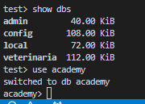

# Requisitos:

Crear una colección llamada profesores con validación de esquema que incluya los siguientes campos requeridos:

nombre (string, mínimo 2 caracteres)

edad (entero, entre 25 y 70)

especialidad (string)

añosExperiencia (entero, mínimo 0)


## ejercicio 1-1
```
db.createCollection("profesores",{
    validator :{
        $jsonSchema: {
            bsonType: "object",
            required:[
                "nombre",
                "edad",
                "especialidad",
                "añosExperiencia"
            ],
            properties:{
                nombre:{ bsonType: "string", minLength: 2},
                edad: { bsonType: "int", minimum: 25, maximum: 70},
                especialidad: { bsonType: "string"},
                añosExperiencia: { bsonType: "int", minimum: 0}
            }
        }
    
    }

})
```
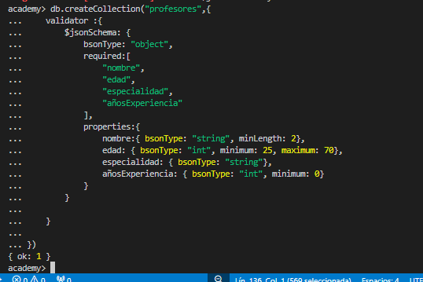


## ejercicio 1-2

Insertar al menos tres documentos de ejemplo que contengantambién los siguientes campos adicionales:

email

departamento

salario

activo (booleano)

```
db.profesores.insertMany([
    {
        nombre: "Franco",
        edad: 25,
        especialidad: "Ingeniero",
        añosExperiencia: 2,
        email: "franco@gmail.com",
        departamento: "Ingeniería",
        salario: 1000,
        activo: true
    },
    {
        nombre: "Pepe",
        edad: 27,
        especialidad: "Ingeniero",
        añosExperiencia: 3,
        email: "pepe@gmail.com",
        departamento: "Ingeniería",
        salario: 1100,
        activo: true
    },
    {
        nombre: "Juan",
        edad: 28,
        especialidad: "Administrador",
        añosExperiencia: 4,
        email: "juan@gmail.com",
        departamento: "Ingeniería",
        salario: 1200,
        activo: true
    }

])
```
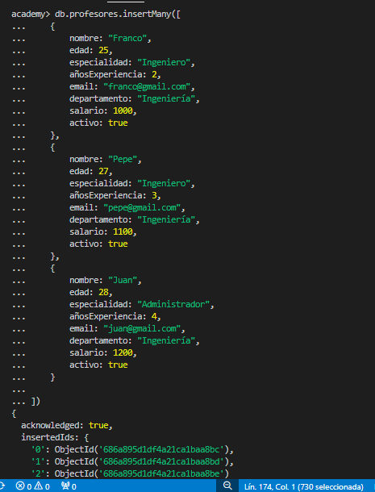


Agregue uno mas para que el siguiente punto de filtrar a los profesores que tengan más de 15 años de experiencia.

```
db.profesores.insertOne({
    nombre: "Marcelo",
    edad: 30,
    especialidad: "Ingeniero",
    añosExperiencia: 20,
    email: "Marcelo@gmail.com",
    departamento: "Ingeniería",
    salario: 2000,
    activo: true
})

```


## ejercicio 1-3

Realizar las siguientes consultas:

Buscar todos los profesores con más de 15 años de experiencia.


```
db.profesores.find({
    añosExperiencia: {
        $gt: 15
    }
})
```
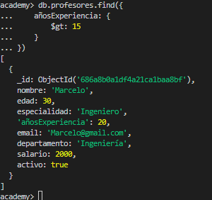

 Calcular el promedio de edad, experiencia y salario de los profesores activos.

```
db.profesores.aggregate([
    { $match:{ activo: true}},
    {
        $group: {
            _id: null ,
            edad: {
                $avg: "$edad"
            },
            añosExperiencia: {
                $avg: "$añosExperiencia"
            },
            salario: {
                $avg: "$salario"
            },
        }
    }

])
```
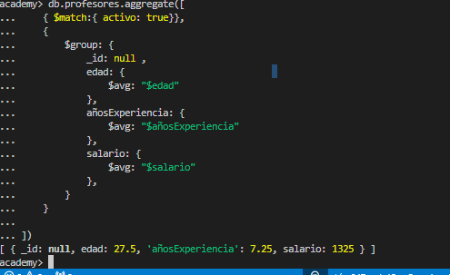


Generar estadísticas por departamento: número de profesores, experiencia total, salario promedio y listado de nombres.

-> solo tenia profesores con departamento ingenieria, agregue un usuario mas en otro departamento para filtrar. y se vea que el codigo funciona

```
db.profesores.insertOne({
    nombre: "Gonzalo",
    edad: 40,
    especialidad: "Administrador",
    añosExperiencia: 10,
    email: "Gonzalo@gmail.com",
    departamento: "Administrativo",
    salario: 1500,
    activo: true
})
```

```
db.profesores.aggregate([
    {
        $group : {
            _id: "$departamento",
            númeroProfesores: {
                $sum: 1
            },
            experienciaTotal: {
                $sum: "$añosExperiencia"
            },
            salarioPromedio: {
                $avg: "$salario"
            },
            nombresProfesores: {
                $push: "$nombre"
            }
        
        }
    }


])
```
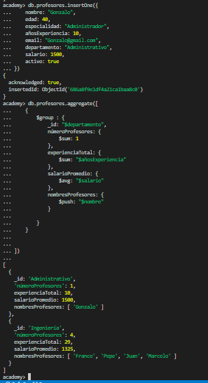


# 📚 Ejercicio 2: Sistema de Cursos y Matriculaciones
Diseña una colección para administrar los cursos y su proceso de inscripción.

## ejercicio 2-1
Crear una colección llamada cursos e insertar al menos dos documentos con los siguientes campos:

 codigo (ej. "MAT101")

 nombre

 creditos

 profesorId (relación con la colección profesores)

 horario: un objeto con los días y el horario del curso.

 cupoMaximo

 inscritos: un arreglo inicialmente vacío.

## antes de insertar realize un update dentro de horarios el array "dia" a "dias" para clarificar la estructura

```
db.createCollection("cursos", {
    validator: {
        $jsonSchema: {
            bsonType: "object",
            required:[
                "codigo",
                "nombre",
                "creditos",
                "profesorId",
                "horario",
                "cupoMaximo",
                "inscritos"
            ],
            properties: {
                codigo:{
                    bsonType: "string",
                },
                nombre:{
                    bsonType: "string",
                },
                creditos:{
                     bsonType: "int", minimum: 1 
                },
                profesorId:{
                    bsonType: "objectId",
                },
                horario:{
                    bsonType: "object",
                    required:["dia","hora"],
                    properties:{
                        dia:{
                            bsonType: "array",
                            items: {
                                bsonType: "string",
                                enum: ["lunes", "martes", "miércoles", "jueves", "viernes", "sábado", "domingo"]
                            },
                            minItems: 1
                        },
                        hora:{
                            bsonType: "string",
                            enum: [
                                    "08:00-10:00",
                                    "09:00-11:00",
                                    "10:00-12:00",
                                    "11:00-13:00",
                                    "12:00-14:00",
                                    "13:00-15:00",
                                    "14:00-16:00",
                                    "15:00-17:00",
                                    "16:00-18:00"
                                ]
                        }
                    }
                },
                cupoMaximo:{
                    bsonType: "int",
                    minimum: 1
                },
                inscritos:{
                    bsonType: "array",
                    description: "Lista de estudiantes inscritos",
                    items: {}
                }
            }
        }
    }

})
```
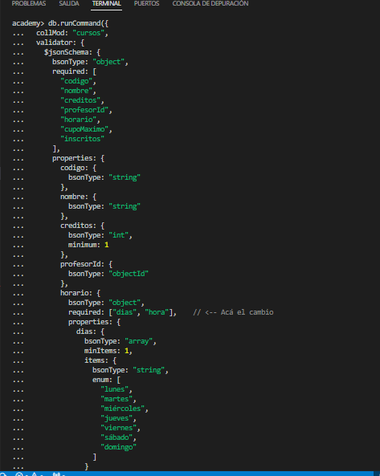

```
db.cursos.insertMany([
  {
    codigo: "MAT101",
    nombre: "Matemática I",
    creditos: 4,
    profesorId: ObjectId("686a895d1df4a21ca1baa8bc"),
    horario: {
      dias: ["lunes", "miércoles"],
      hora: "08:00-10:00"
    },
    cupoMaximo: 30,
    inscritos: []
  },
  {
    codigo: "FIS102",
    nombre: "Física General",
    creditos: 3,
    profesorId: ObjectId("686a895d1df4a21ca1baa8bd"), 
    horario: {
      dias: ["martes", "jueves"],
      hora: "14:00-16:00"
    },
    cupoMaximo: 25,
    inscritos: []
  }
]);
```
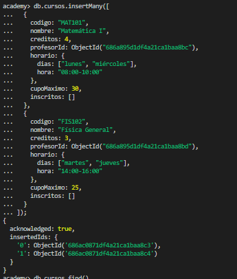


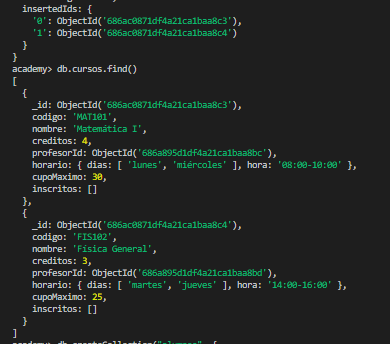

## ejercicio 2-2 
Matricular un alumno en un curso agregando al arreglo inscritos un objeto con:

alumnoId

fechaInscripcion (fecha actual)

estado (ej. "activo")

```
db.createCollection("alumnos", {
  validator: {
    $jsonSchema: {
      bsonType: "object",
      required: ["nombre", "email", "activo"],
      properties: {
        nombre: { bsonType: "string", minLength: 2 },
        email: { bsonType: "string"},
        activo: { bsonType: "bool" }
      }
    }
  }
});
```
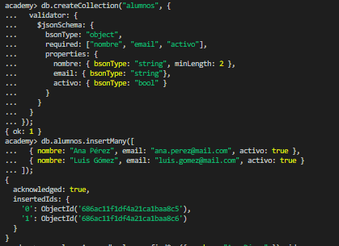
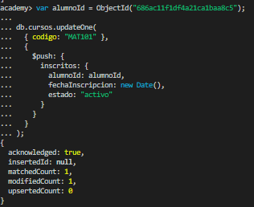


# ejercicio 2-3
 Consultar los cursos con cupos disponibles, calculando el número de cupos restantes y mostrando solo aquellos con disponibilidad.

``` 

db.cursos.aggregate([
    {
        $addFields: {
            ocupados:{$size: "$inscritos"},
            disponibles:{$subtract: ["$cupoMaximo", {$size: "$inscritos"}]}
        }
    },
    {
        $match: {disponibles: {$gt: 0}}
    },
    {
        $project: {
            codigo: 1,
            nombre: 1,
            cupoMaximo: 1,
            ocupados: 1,
            disponibles: 1
        }
    }
])
```
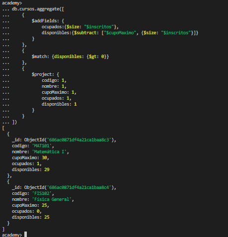