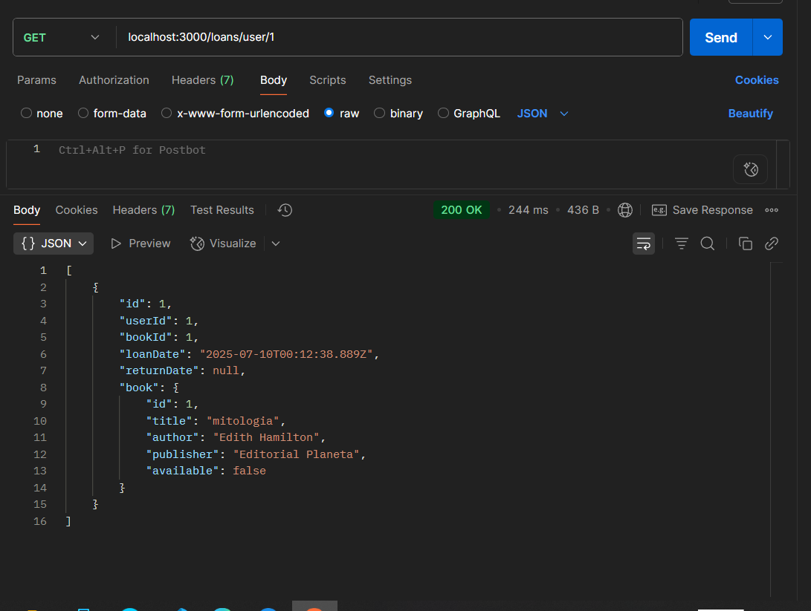

# 🎯 Ejercicio Práctico en la carpeta api-library-nest

##  Crear un sistema de gestión de biblioteca

### 1 Modelar entidades:

    Libro (Book): id, titulo, autor, publicado, disponible

    Usuario (User): id, nombre, email

    Préstamo (Loan): id, user, book, fechaPrestamo, fechaDevolucion

### 2  Definir relaciones:

    Un User puede tener muchos Loan

    Un Book puede tener muchos Loan

Ejercicio 1 y 2

### 3 Usar Prisma Client para:

    1 - Registrar un nuevo préstamo

    2 - Consultar libros disponibles

    3 - Mostrar historial de préstamos por usuario

antes cargo en mi db datos

El book id -> 1 esta available como false porque cargue un prestamo loan con ese id 

1 - registro de un nuevo préstamo

2 - consulta de libros disponibles

3 - consulta de historial de préstamos

# pre requisitos
nest new .

## paso 1

creando docker-compose para postgres y luego usar el comando docker compose up -d
luego usar prisma studio

 # dependencia de prisma
 pnpm add -D prisma

 # inicializo prisma
pnpm prisma init

 # en env 
 configuro mi database url

 # en prisma/schema.prisma

modelo las tablas con su relacion

# nuestra primer migracion 
pnpm prisma migrate dev --name init

# se usa libreria prisma client
instalar prisma client
pnpm add -D @prisma/client
para usar por ejemplo 
prisma.user.findMany()
prisma.book.create()

# ahora crear para prisma 
service
module
controller 

users
nest generate module users
nest generate controller users
nest generate service users

loans
nest generate module loans
nest generate controller loans
nest generate service loans

book
nest generate module books
nest generate controller books
nest generate service books

creo los repositorios y dtos

cada carpeta tiene su repositorio y su dto
en el repositorio tengo la logica

# instalo paquetes de validacion como ejericios anteriores
pnpm add class-validator class-transformer

Al final con pnpm prisma studio veo que tengo la base de datos
con estos codigos cargados 
por ejemplo 

