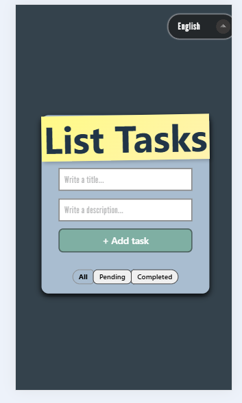
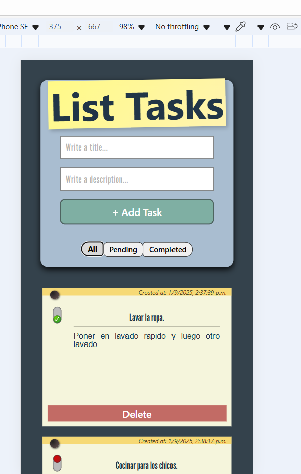
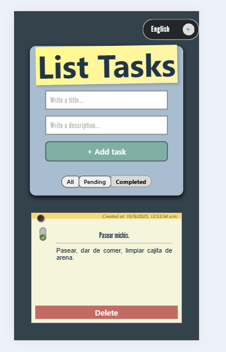
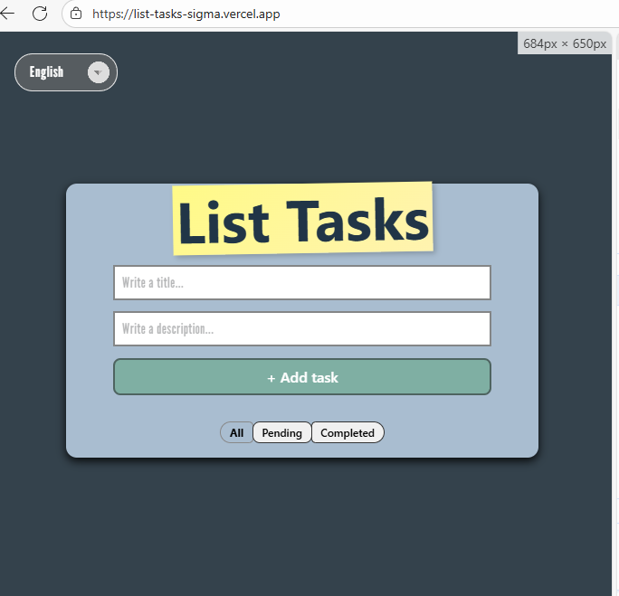
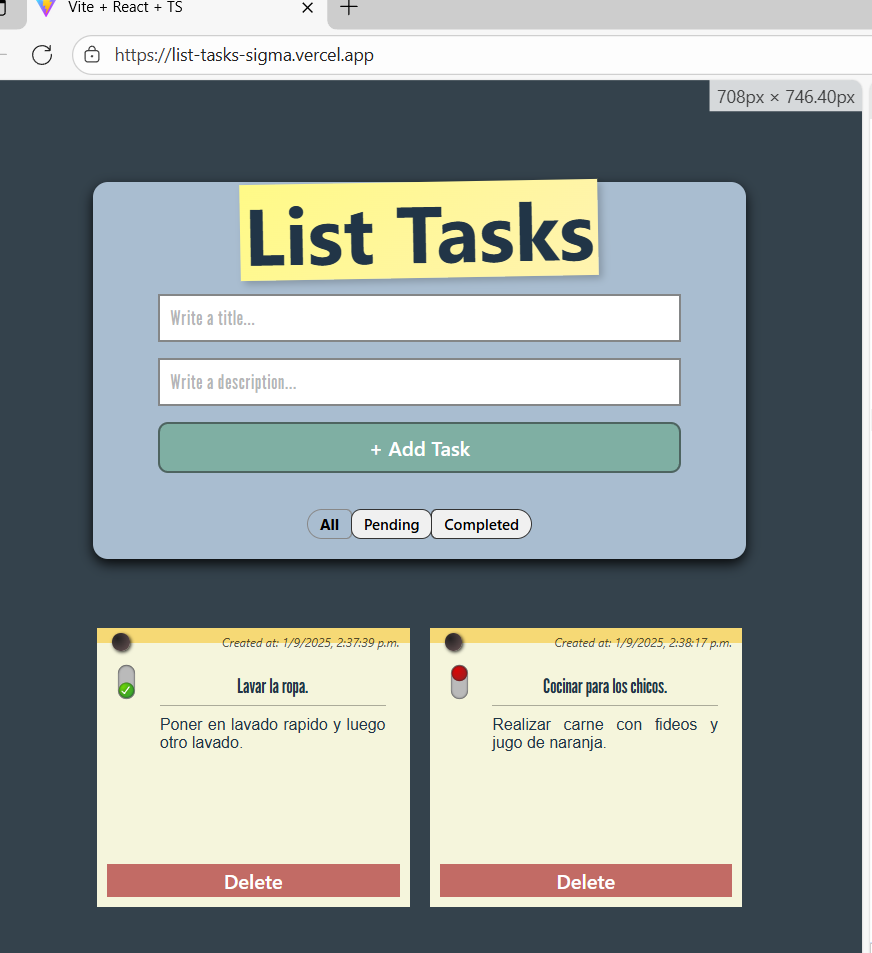
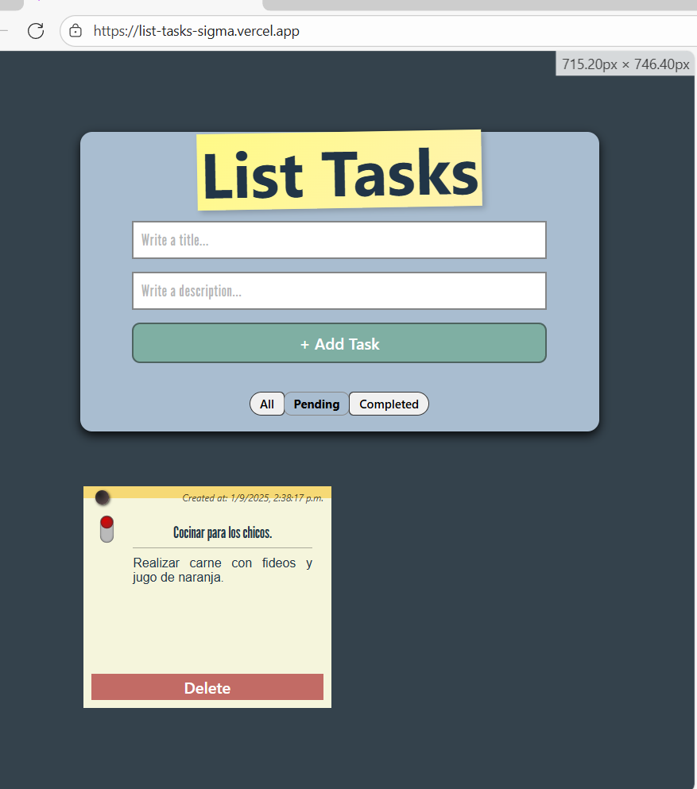
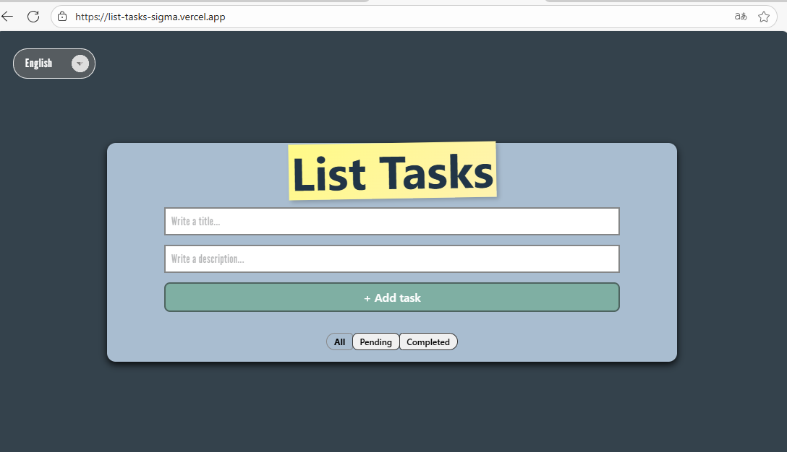
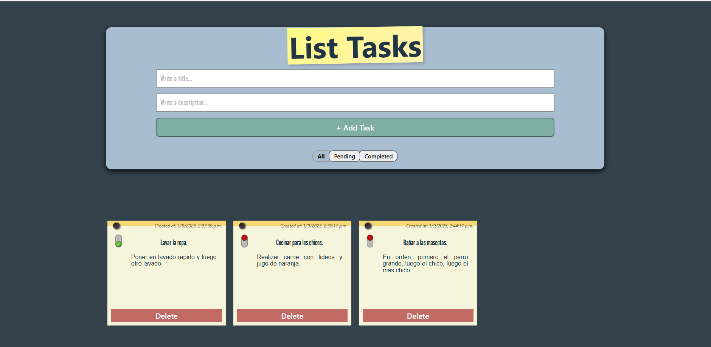

# 📋 ListTasks

Aplicación web sencilla, dinamica y responsiva para gestionar tareas, desarrollada con React + TypeScript + vite.
Permite agregar tareas, listarlas y mantener un diseño responsivo (móvil → tablet → escritorio).

## 📝 Descripción

Esta aplicación web comenzó como una actividad sencilla. Pero fue escalando en cuanto a mejorar la experiencia del usuario, y recibir feedbacks positivos constantes, realizando una pequeña busqueda de campo y preguntar a usuarios sobre si lo usarian y estaban interesados en usar la aplicación.

# 🚀 Características principales

- ➕ Agregar nuevas tareas

- ✅ Marcar tareas como completadas

- ❌ Eliminar tareas

- 🔎 Filtrar tareas (todas, completadas, pendientes)

- 📱 Diseño responsivo (móvil → tablet → escritorio)

# Extras

- 🌍 Selección de idioma (ingles/ español)

- 🌓 Adaptación automática al navegador (modo claro/oscuro) 

- 💻 Guardar tareas en localStorage para mantener las tareas en cualquier momento.


# Breakpoints adaptados:

Mobile-first (0-600)

Tablet (600-991)

Desktop adaptados (992-1199)

Desktop (1200- en adelante)

🛠️ Tecnologías utilizadas

- React
- TypeScript
- Vite
- Font Awesome
- google fonts

# Instalación

```
# Clonar el repositorio
git clone https://github.com/tu-usuario/list-tasks.git

# Entrar al directorio
cd list-tasks

# Instalar dependencias
pnpm install

# Ejecutar en desarrollo
pnpm dev


```

# vista previa

 ## Mobile




 ## Tablet

 



# Desktop

 
 


📄 Licencia

### Franco Torrico

