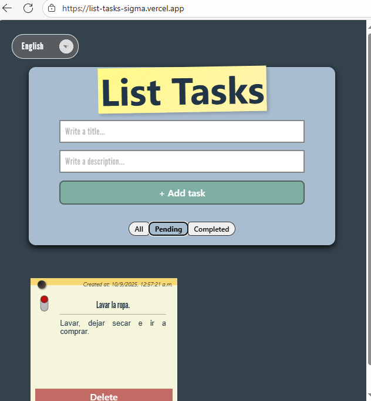
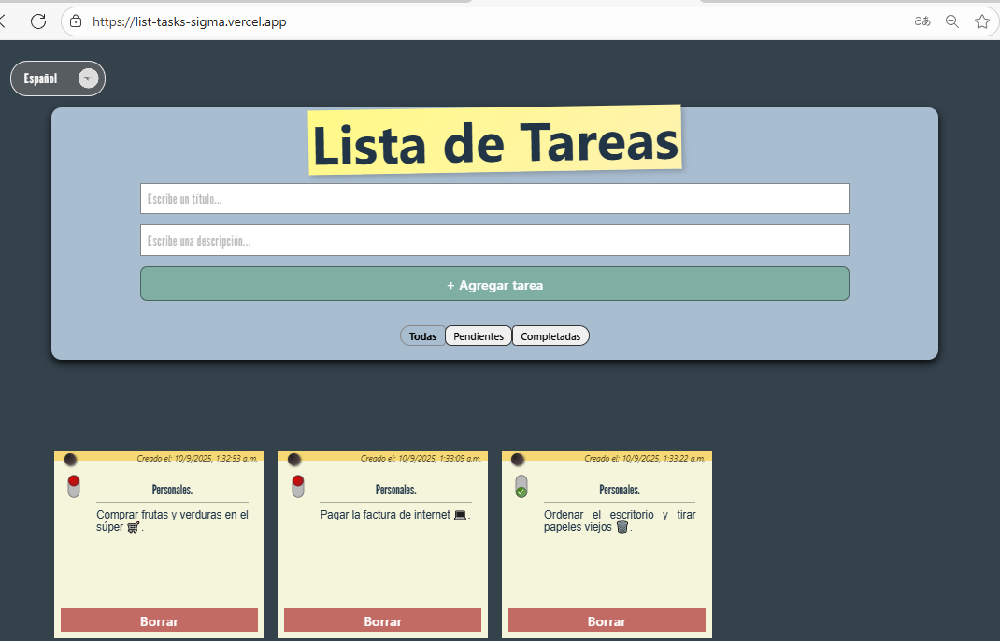

📋 ListTasks

Aplicación web sencilla para gestionar tareas, desarrollada con React + TypeScript + TailwindCSS.
Permite agregar tareas, listarlas y mantener un diseño responsivo (móvil → tablet → escritorio).

🚀 Características

➕ Agregar nuevas tareas

✅ Marcar tareas como completadas

❌ Eliminar tareas

🔎 Filtrar tareas (todas, completadas, pendientes)

📱 Diseño responsivo (móvil → tablet → escritorio)

# Breakpoints adaptados:

Mobile-first (0-600)

Tablet (600-991)

Desktop adaptados (992-1199)

Desktop (1200- en adelante)

🛠️ Tecnologías utilizadas

- React
- TypeScript
- Vite
- Font Awesome
- google fonts

# Instalación

```
# Clonar el repositorio
git clone https://github.com/tu-usuario/list-tasks.git

# Entrar al directorio
cd list-tasks

# Instalar dependencias
pnpm install

# Ejecutar en desarrollo
pnpm dev


```

# vista previa

 ## Mobile


 ## Tablet

 



# Desktop

 
 


📄 Licencia

### Franco Torrico

