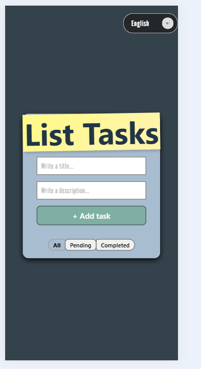
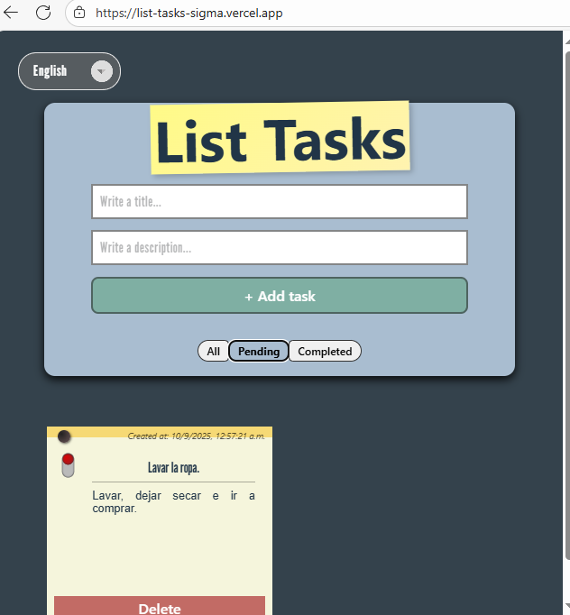
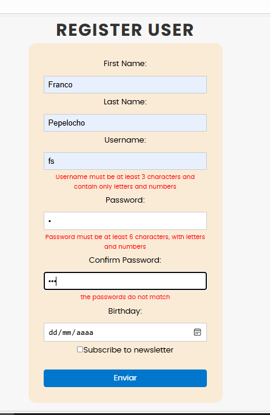
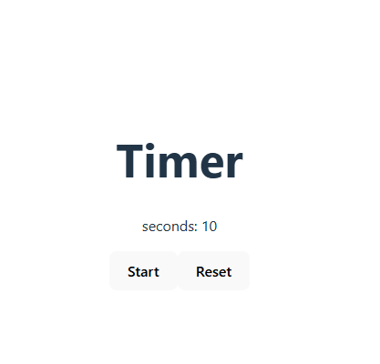
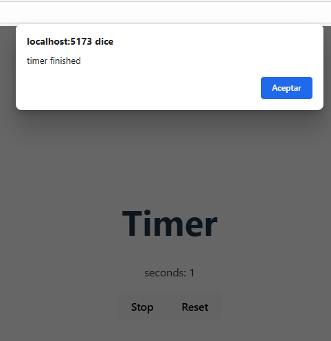

# 🎯 Ejercicios Prácticos

# Ejercicio 1: Lista de Tareas
Crea un componente que permita:

Agregar nuevas tareas.
Marcar tareas como completadas.
Eliminar tareas.
Filtrar tareas (todas, completadas, pendientes)

# Ejercicio 2: Formulario de Contacto
Implementa un formulario con:

Validación en tiempo real.
Manejo de errores.
Estados de carga.
Envío de datos.

# Ejercicio 3: Hook Personalizado
Crea un hook useTimer que:

Maneje un temporizador.
Permita pausar/reanudar.
Tenga función de reset.
Ejecute callback cuando llegue a cero.

